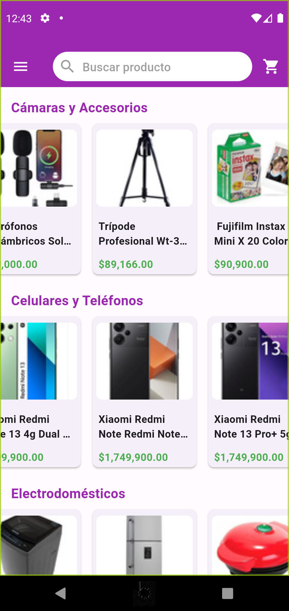
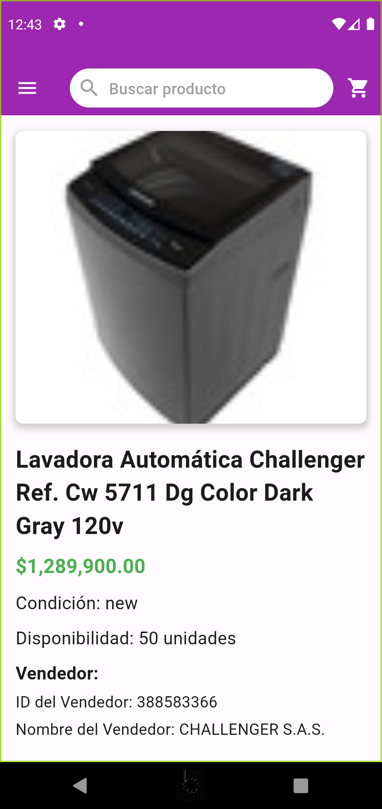
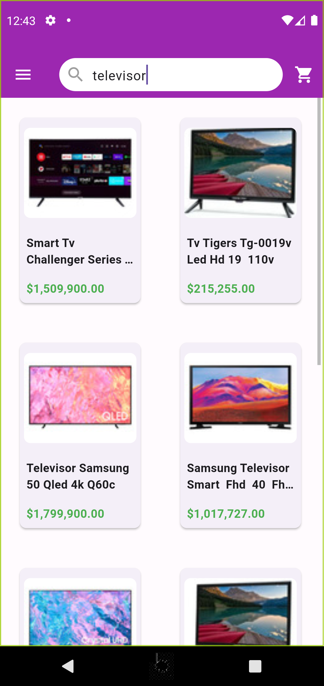

# Meli-app

A new Flutter project with [Mercadolibre API](https://developers.mercadolibre.com.ar/es_ar/items-y-busquedas#Buscar-art%C3%ADculos-por-categor%C3%ADa).

- An application that implements the mercadolibre system.
- I used [flutter_bloc](https://pub.dev/packages/flutter_bloc) package for State Management.
- I used clean architecture


</br>
</br>

## version of flutter and Dart
 - Flutter 3.19.6 
 - Dart 3.3.4 
 - DevTools 2.31.1

## Packages used
 - cupertino_icons: ^1.0.6
 - flutter_bloc: ^8.1.5
 - http: ^1.2.1
 - dartz: ^0.10.1
 - dio: ^5.4.3+1
 - yaml: ^3.1.2
 - get_it: ^7.7.0
 - equatable: ^2.0.5
 - carousel_slider: ^4.2.1
 - cached_network_image: ^3.3.1
 - intl: ^0.19.0
 - fluttertoast: ^8.2.5


## Screenshots

<br>
<p align="center">




  
</p>

## Download APK

[Click here](https://drive.google.com/file/d/1saDmn5fw6AKoXJCHVLVF3YciUNdVChgp/view?usp=sharing) to download the application from Google Drive

## How to use

To clone and run this application, you'll need [Git](https://git-scm.com/downloads) and [Flutter](https://flutter.dev/docs/get-started/install) installed on your computer. From your command line:

```
# Clone this repository
$ git clone https://github.com/alejogrande/meli.git

# Install dependencies
$ flutter packages get

# Run the app
$ flutter run
```
